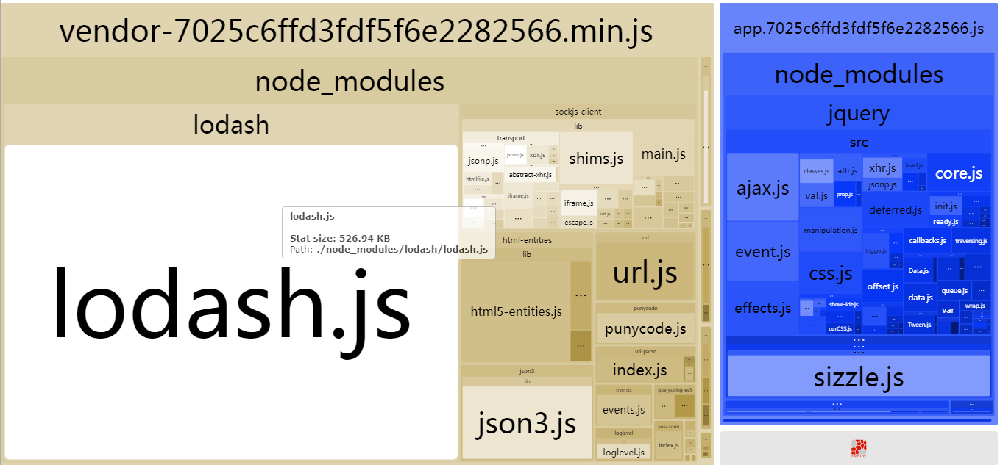
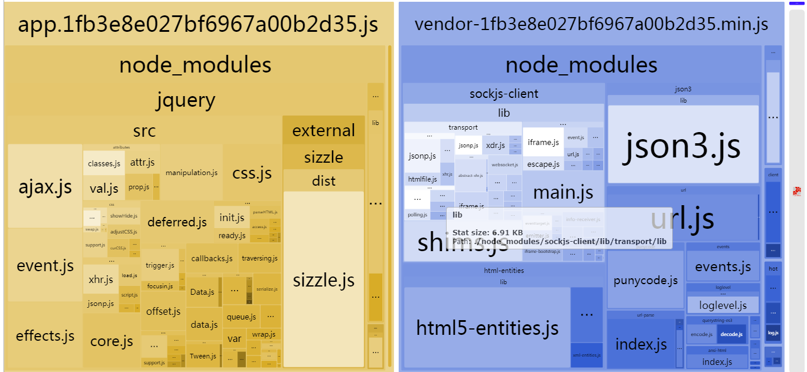

# webpack-demo
Learn webpack, simple webpack configuration example

&emsp;&emsp;Webpack 是当下最热门的前端资源模块化管理和打包工具。它可以将许多松散的模块按照依赖和规则打包成符合生产环境部署的前端资源。还可以将按需加载的模块进行代码分隔，等到实际需要的时候再异步加载。通过 loader 的转换，任何形式的资源都可以视作模块，比如 CommonJs 模块、 AMD 模块、 ES6 模块、CSS、图片、 JSON、Coffeescript、 LESS 等。

 - 前提条件

&emsp;&emsp;在开始之前，请确保安装了 Node.js 的最新版本。使用 Node.js 最新的长期支持版本(LTS - Long Term Support)，是理想的起步。使用旧版本，你可能遇到各种问题，因为它们可能缺少 webpack 功能以及/或者缺少相关 package 包。

 - 本地安装

要安装最新版本或特定版本，请运行以下命令之一：

>npm install --save-dev webpack

>npm install --save-dev webpack@<version>

 - 全局安装

以下的 NPM 安装方式，将使 webpack 在全局环境下可用：

>npm install --global webpack

clone远程仓库到本地：
>git clone https://github.com/San-Shui/webpack-demo.git

进入webpack-demo目录
>cd webpack-demo

安装依赖
> yarn install 或者 npm install 

运行项目

>yarn run start 或者 npm run start

webpack优化参考：
 >[Webpack 打包优化之体积篇](http://jeffjade.com/2017/08/06/124-webpack-packge-optimization-for-volume/)

 >[Webpack 打包优化之速度篇](http://jeffjade.com/2017/08/12/125-webpack-package-optimization-for-speed/)

下面内容是站在巨人的肩膀上对优化进行适当的补充和演示：

### 1、外部引入模块(CDN)

 &emsp;&emsp;在没有优化之前，如果执行npm run start，你会发现输出了一个非常巨大的文件。进一步观察该文件，你会发现 lodash 和你的代码被一起打包了。 然而对于你的 library 本身来说，并不需要打包 lodash。因此你可能会想将该外部扩展(external)的控制权交给你的用户。

 

这一点可以通过配置 externals 来实现：

webpack.config.js配置
```
  externals: {
      "lodash": {
          commonjs: "lodash",
          commonjs2: "lodash",
          amd: "lodash",
          root: "_"
      }
  }
```
index.html引入lodash

```
<!doctype html>
<html>
<head>
  <meta charset="utf-8" />
  <title>My App</title>
  <script type='text/javascript' src='https://unpkg.com/lodash@4.16.6'></script>
</head>
<body>
</body>
</html>
```
index.js使用lodash

```
document.write(_.capitalize('fred'))
```
运行npm run start 查看打包结果：



此时webpack不在打包lodash，而是外部引入。

增强代码代码压缩工具

### 2、按需异步加载模块

按需加载可以参考我之前写的博客[ vue按需加载组件-webpack require.ensure](http://blog.csdn.net/qq_27626333/article/details/76228578)

### 3、增强代码代码压缩工具

&emsp;&emsp;生产环境的构建，uglify过程占了70%左右的时间，是一个非常耗时的过程。相对于webpack原生UglifyJsPlugin，FastUglifyJsPlugin增加了多进程和缓存。多进程可以最大限度的利用多核cpu的计算能力，缓存可以按需编译，减少不必要的计算。以下是一组性能测试数据，FastUglifyJsPlugin的性能提升非常明显。

 插件                               | 耗时           
------------------------------------|-----------
 webpack.optimize.UglifyJsPlugin    | 7.4 min 
FastUglifyJsPlugin without cache    | 4.45 min      
FastUglifyJsPlugin with cache       | 36 s 

测试样本：29 entry,2615 modules

测试环境：MacBook Pro，4核cpu,8g内存

 - 安装
```
npm i fast-uglifyjs-plugin --save-dev
```
 或者
```
yarn add fast-uglifyjs-plugin --dev
```
 - 配置

&emsp;&emsp;FastUglifyJsPlugin基于webpack.optimize.UglifyJsPlugin修改，用法和webpack.optimize.UglifyJsPlugin完全一样，只是增加了几个额外的配置参数。

```
var FastUglifyJsPlugin = require('fast-uglifyjs-plugin');

module.exports = {
    plugins: [new FastUglifyJsPlugin({
        compress: {
            warnings: false
        },
        // debug设为true可输出详细缓存使用信息:
        debug: true,
        // 默认开启缓存，提高uglify效率，关闭请使用:
        cache: false,
        // 默认缓存路径为项目根目录，手动配置请使用:
        cacheFolder: path.resolve(__dirname, '.otherFolder'),
        // 工作进程数，默认os.cpus().length
        workerNum: 2
    })]
};
```

